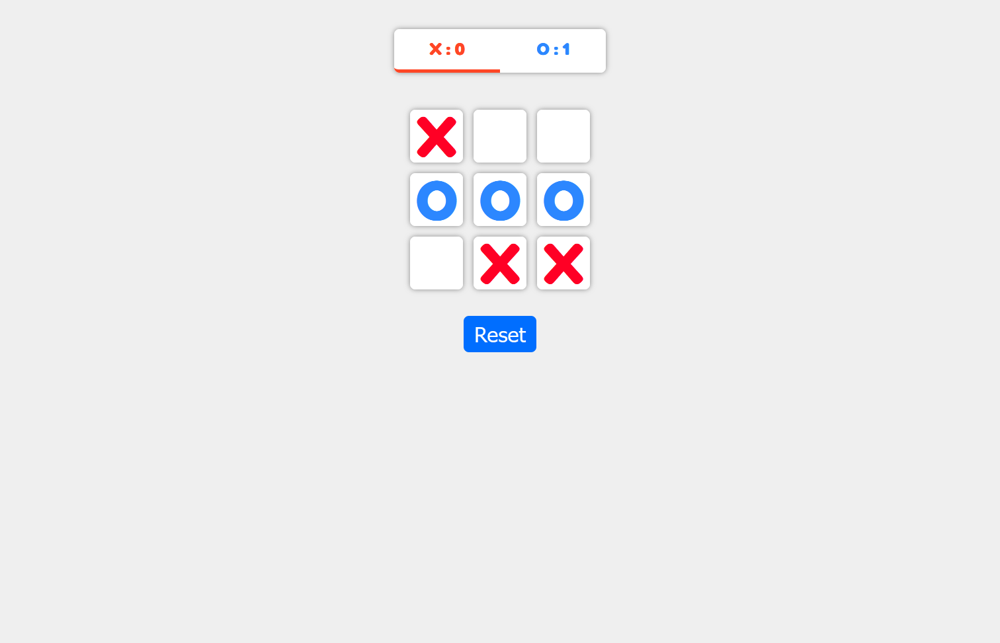

## <p align="center">Calculator App</p>

[](https://https://xs-os-react.netlify.app)

## Features:
* The user can play tic tac toe with a friend.

## Built With
* React

## Todos
1. ~~Add a scoreboard~~
2. Add option to play against the computer
3. Add animations when someone wins.


## Project Setup

```sh
npm install
```

## Compile and Hot-Reload for Development

```sh
npm run dev
```

## Compile and Minify for Production

```sh
npm run build
```

